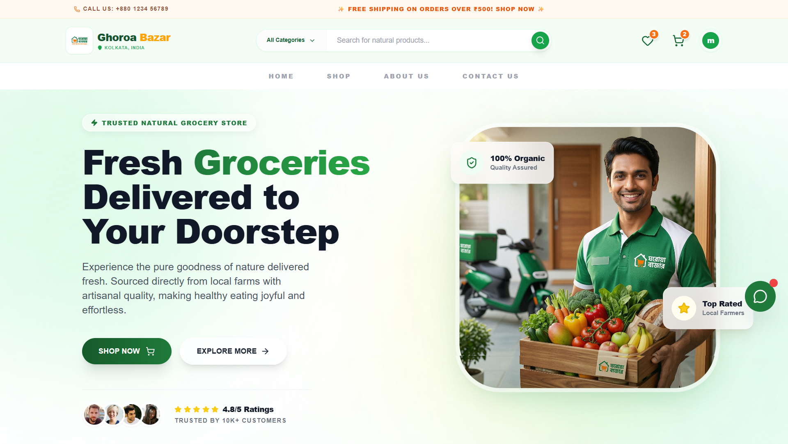
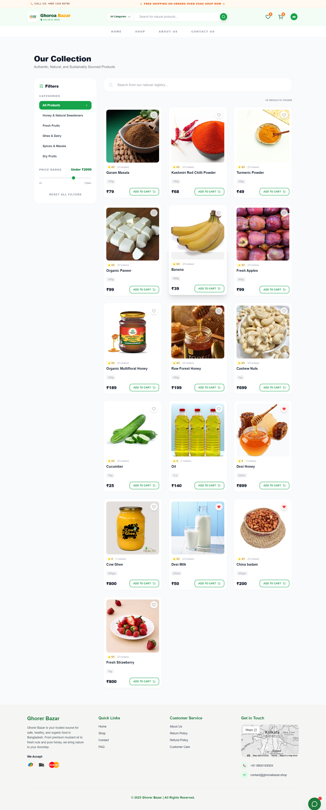
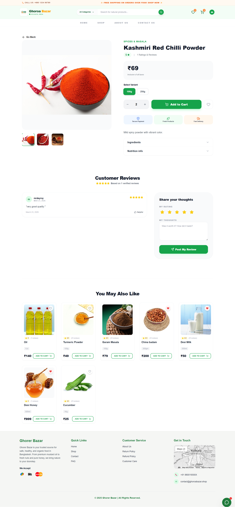
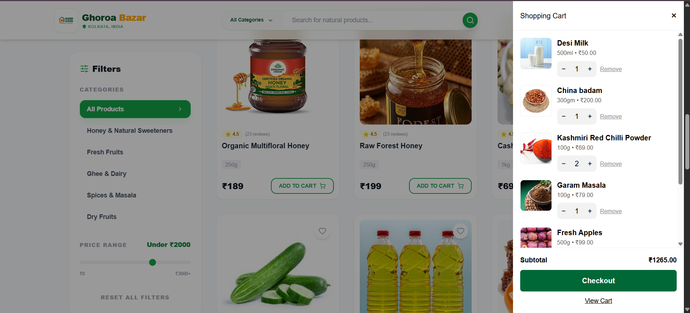
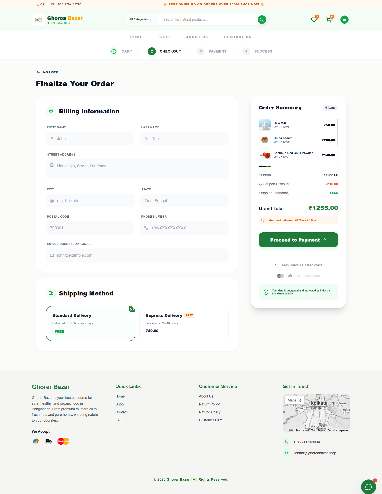
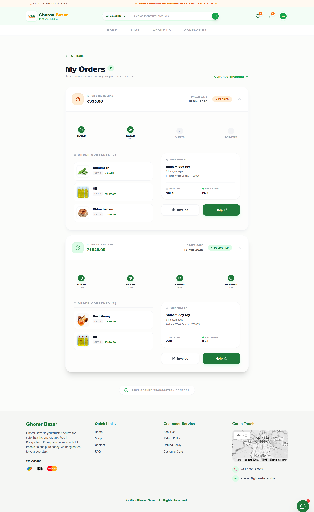
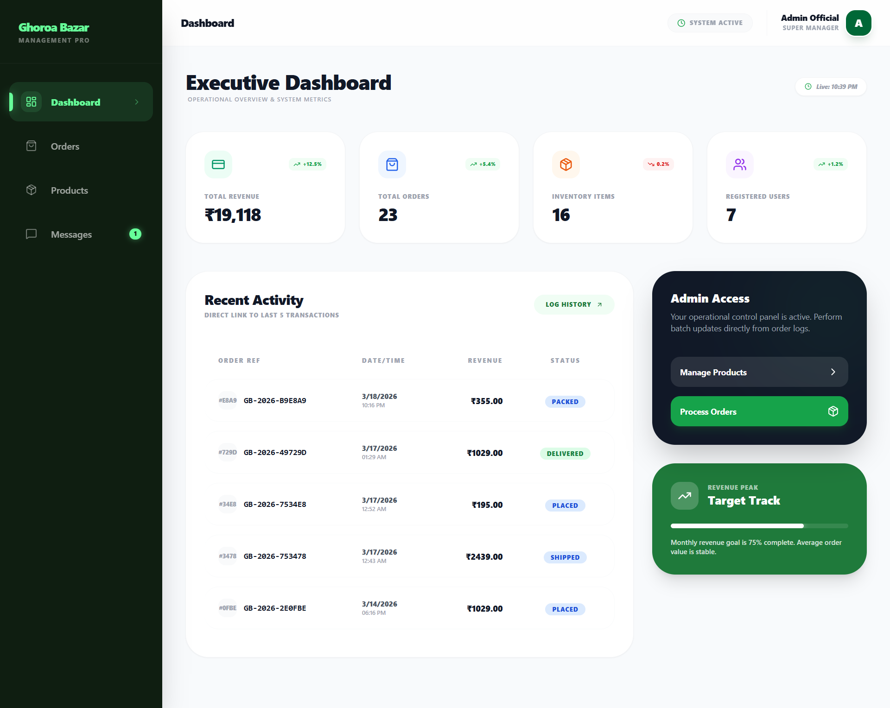

# 🛒 Ghoroa Bazar

> **Your neighbourhood grocery — delivered online.**  
> A full-stack MERN eCommerce platform for fresh groceries with smart recommendations, an AI chatbot, and a sleek modern UI.

---

## 📌 Overview

**Ghoroa Bazar** (Bangla for *Home Market*) is a feature-rich online grocery shopping platform built with the MERN stack. It provides a seamless shopping experience for customers while giving administrators powerful tools to manage products, orders, and users — all in one place.

Whether you're a developer exploring the codebase, a recruiter evaluating the project, or a hackathon judge — this app is built to impress.

---

## 🚀 Features

### 👤 User Features
- **Authentication** — Secure registration & login with JWT, email verification, and forgot/reset password flow
- **Product Browsing** — Browse products by category with filters and a live search modal
- **Product Details** — Detailed product pages with image, description, price, and ratings
- **Cart System** — Add, remove, and update product quantities with a smooth slide-out cart sidebar
- **Wishlist** — Save favourite products for later
- **Checkout** — Address-based checkout with Cash on Delivery support
- **Order History** — View all past orders with statuses under *My Orders*
- **Invoice Page** — Printable invoice for each completed order
- **Contact Form** — Reach out to the team directly from the app
- **User Profile** — Update personal info, profile picture, and saved addresses

### 🛡️ Admin Features
- **Admin Dashboard** — At-a-glance stats: total orders, revenue, users, and products
- **Product Management** — Add, edit, and delete products with image upload via Cloudinary
- **Order Management** — View all orders and update order/payment status
- **Message Centre** — Read customer messages submitted through the contact form

### ✨ Advanced Features
- **Smart Product Recommendations** — Suggests products based on:
  - Current category being viewed
  - Items already in the cart
  - Wishlist items
  - Previous order history
- **Interactive Chatbot** — Floating chatbot with:
  - Predefined quick-question buttons
  - Product suggestion responses
  - Fallback contact prompt for unanswered queries
- **Animated Hero Banner** — Full-width hero with floating animations and parallax effects (Framer Motion)
- **Responsive Design** — Fully mobile-friendly layout across all screen sizes
- **Scroll-to-Top Button** — Global floating button for quick navigation

---

## 🧠 How It Works

```
User → React Frontend (Vite) ──HTTP──▶ Express REST API ──▶ MongoDB
                                              │
                               Cloudinary (Image Upload)
                               Nodemailer  (Email OTP / Reset)
                               Razorpay    (Payment Gateway)
```

1. **Authentication** — Users register/login; the server issues a JWT stored in `localStorage` (or cookies). Protected routes verify the token via middleware.
2. **Products** — Fetched from MongoDB, filtered by category/search query on the backend. Images are hosted on Cloudinary.
3. **Cart & Wishlist** — Managed through React Context API (`AuthContext`), persisted to the database for logged-in users.
4. **Orders** — Placed from the Checkout page; stored in MongoDB with status tracking. Admin can update order/payment status.
5. **Recommendations** — The Home page analyses the user's cart, wishlist, and order history to surface relevant products from matching categories.
6. **Chatbot** — A client-side component that matches user input against predefined intents and product data, with a fallback for unrecognised queries.

---

## 🛠️ Tech Stack

| Layer | Technology |
|---|---|
| **Frontend** | React 18 (Vite), Tailwind CSS, Framer Motion |
| **Backend** | Node.js, Express.js |
| **Database** | MongoDB, Mongoose ODM |
| **Authentication** | JSON Web Tokens (JWT), bcrypt |
| **Image Hosting** | Cloudinary + Multer |
| **Email Service** | Nodemailer |
| **Payment** | Razorpay |
| **State Management** | React Context API |
| **Routing** | React Router v6 |
| **Dev Tools** | Nodemon, Vite HMR |

---

## 📂 Project Structure

```
GB_updated/
├── backend/
│   ├── middleware/          # Auth & admin middleware
│   ├── models/              # Mongoose schemas
│   │   ├── User.js
│   │   ├── Product.js
│   │   ├── Order.js
│   │   ├── Admin.js
│   │   └── ContactMessage.js
│   ├── routes/              # REST API routes
│   │   ├── userRoutes.js
│   │   ├── productRoutes.js
│   │   ├── orderRoutes.js
│   │   ├── adminRoutes.js
│   │   ├── uploadRoutes.js
│   │   └── contact.js
│   ├── utils/               # Helper utilities
│   ├── server.js            # Express entry point
│   └── .env                 # Environment variables
│
└── frontend/
    └── src/
        ├── components/      # Reusable UI components
        │   ├── Hero.jsx
        │   ├── Navbar.jsx
        │   ├── ChatBot.jsx
        │   ├── ProductCard.jsx
        │   ├── CartSidebar.jsx
        │   ├── SearchModal.jsx
        │   └── ...
        ├── pages/           # Route-level page components
        │   ├── Home.jsx
        │   ├── Products.jsx
        │   ├── ProductDetails.jsx
        │   ├── Cart.jsx
        │   ├── Checkout.jsx
        │   ├── MyOrders.jsx
        │   ├── Invoice.jsx
        │   ├── Wishlist.jsx
        │   ├── Profile.jsx
        │   ├── AdminDashboard.jsx
        │   ├── AdminProducts.jsx
        │   ├── AdminOrders.jsx
        │   ├── AdminMessages.jsx
        │   └── ...
        ├── context/         # React Context (Auth, Cart, etc.)
        ├── layouts/         # Layout wrappers
        ├── constants/       # Shared constants
        └── App.jsx          # Root app with routes
```

---

## ⚙️ Installation & Setup

### Prerequisites
- Node.js v18+ and npm
- MongoDB (local instance or MongoDB Atlas)
- Cloudinary account
- Razorpay account (for payment integration)

---

### 1. Clone the Repository

```bash
git clone https://github.com/your-username/ghoroa-bazar.git
cd ghoroa-bazar
```

---

### 2. Install Backend Dependencies

```bash
cd backend
npm install
```

---

### 3. Install Frontend Dependencies

```bash
cd ../frontend
npm install
```

---

### 4. Configure Environment Variables

Create a `.env` file in the `backend/` directory (see [Environment Variables](#-environment-variables) section below).

---

### 5. Run the Backend

```bash
cd backend
npm run dev
# Runs on http://localhost:5000
```

---

### 6. Run the Frontend

```bash
cd frontend
npm run dev
# Runs on http://localhost:5173
```

---

## 🔑 Environment Variables

Create `backend/.env` with the following:

```env
# Server
PORT=5000

# MongoDB
MONGO_URI=mongodb+srv://<username>:<password>@cluster.mongodb.net/ghoroa-bazar

# JWT
JWT_SECRET=your_super_secret_jwt_key

# Cloudinary
CLOUDINARY_CLOUD_NAME=your_cloud_name
CLOUDINARY_API_KEY=your_api_key
CLOUDINARY_API_SECRET=your_api_secret

# Nodemailer (Email)
EMAIL_USER=your_email@gmail.com
EMAIL_PASS=your_app_password

# Razorpay
RAZORPAY_KEY_ID=your_razorpay_key_id
RAZORPAY_KEY_SECRET=your_razorpay_key_secret

# Frontend URL (for CORS)
CLIENT_URL=http://localhost:5173
```

> ⚠️ **Never commit your `.env` file to version control.** It is already listed in `.gitignore`.

---

## 🌐 API Endpoints

### Auth (`/api/users`)
| Method | Endpoint | Description |
|---|---|---|
| POST | `/register` | Register a new user |
| POST | `/login` | User login (returns JWT) |
| GET | `/profile` | Get current user profile |
| PUT | `/profile` | Update user profile |
| POST | `/forgot-password` | Send password reset email |
| POST | `/reset-password` | Reset password with token |

### Products (`/api/products`)
| Method | Endpoint | Description |
|---|---|---|
| GET | `/` | Get all products (with filters) |
| GET | `/:id` | Get single product |
| POST | `/` | Add product *(Admin)* |
| PUT | `/:id` | Update product *(Admin)* |
| DELETE | `/:id` | Delete product *(Admin)* |

### Orders (`/api/orders`)
| Method | Endpoint | Description |
|---|---|---|
| POST | `/` | Place a new order |
| GET | `/my-orders` | Get logged-in user's orders |
| GET | `/` | Get all orders *(Admin)* |
| PUT | `/:id` | Update order status *(Admin)* |

### Admin (`/api/admin`)
| Method | Endpoint | Description |
|---|---|---|
| POST | `/login` | Admin login |
| GET | `/dashboard-stats` | Get dashboard statistics |

### Contact (`/api/contact`)
| Method | Endpoint | Description |
|---|---|---|
| POST | `/` | Submit a contact message |
| GET | `/` | Get all messages *(Admin)* |

### Upload (`/api/upload`)
| Method | Endpoint | Description |
|---|---|---|
| POST | `/` | Upload image to Cloudinary |

---

## 📸 Screenshots

| Page | Preview |
|---|---|
| 🏠 Hero |  |
| 🛍️ Products |  |
| 📦 Product Details |  |
| 🛒 Cart Sidebar |  |
| 💳 Checkout |  |
| 📋 My Orders |  |
| 🤖 Chatbot |  |
| 🛡️ Admin Dashboard |  |

---

## 👨‍💻 Author & Credits

**Developed by:** [Shibam Dey Roy]  
**GitHub:** [@mrdeyroy](https://github.com/mrdeyroy)  
**LinkedIn:** [Shibam Dey Roy](https://linkedin.com/in/shibamdeyroy)  

---

### 🙏 Acknowledgements

- [MongoDB Atlas](https://www.mongodb.com/atlas) — Cloud Database
- [Cloudinary](https://cloudinary.com) — Image CDN
- [Razorpay](https://razorpay.com) — Payment Gateway
- [Framer Motion](https://www.framer.com/motion/) — Animations
- [Tailwind CSS](https://tailwindcss.com) — Styling
- [React Icons](https://react-icons.github.io/react-icons/) — Icon Library

---

<div align="center">

⭐ **If you found this project helpful, please give it a star!** ⭐

*Built with ❤️ using the MERN Stack*

</div>
