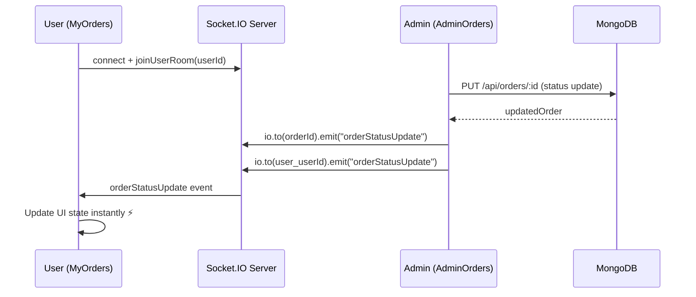

# Real-Time Order Tracking — Implementation Summary

## Overview
Full Socket.IO integration for live order tracking. When admin updates order status, users see instant updates without page refresh.

## Architecture



## Files Modified

| File | Change |
|------|--------|
| [server.js](file:///c:/Users/Lenovo/Desktop/GB_updated/backend/server.js) | Integrated Socket.IO with Express via `http.createServer()` |
| [orderRoutes.js](file:///c:/Users/Lenovo/Desktop/GB_updated/backend/routes/orderRoutes.js) | Emit `orderStatusUpdate` to order + user rooms after DB update |
| [MyOrders.jsx](file:///c:/Users/Lenovo/Desktop/GB_updated/frontend/src/pages/MyOrders.jsx) | Full real-time tracking: socket connect, listener, toast, flash animation |

## Files Created

| File | Purpose |
|------|---------|
| [socket.js](file:///c:/Users/Lenovo/Desktop/GB_updated/frontend/src/utils/socket.js) | Singleton socket instance with auto-reconnect |

## Packages Installed

| Package | Side | Version |
|---------|------|---------|
| `socket.io` | Backend | Latest |
| `socket.io-client` | Frontend | Latest |

## Status Flow
```
Placed → Packed → Shipped → Delivered
```

## Key Features

### Backend
- Socket.IO integrated with existing Express server (same port)
- Room-based architecture: each order + each user gets their own room
- Emit to specific rooms only — no broadcasting to all clients
- CORS configured for frontend URL

### Frontend
- **Live connection indicator** — green "Live" / red "Offline" badge
- **Toast notifications** — slide-in alerts with status-specific messages
- **Flash animations** — order card glows green when status changes
- **Stepper UI pulse** — current step icon scales up with ring animation
- **Status messages** — contextual messages like "Your order is on the way! 🚚"
- **Auto-reconnect** — built into socket config
- **Listener cleanup** — all listeners removed on component unmount
- **API-first load** — data loads from REST API, then overlaid with live updates

## Edge Cases Handled
- ✅ Page refresh → data loads from API
- ✅ Socket disconnect → auto-reconnect with exponential backoff
- ✅ Memory leaks → cleanup listeners on unmount
- ✅ Multiple orders → user room catches all updates
- ✅ Expanded order → also joins specific order room

## How to Test
1. Start backend: `cd backend && npm run dev`
2. Start frontend: `cd frontend && npm run dev`
3. Open MyOrders page as a logged-in user
4. Open AdminOrders in another tab/browser
5. Change any order status in admin → user sees instant update with animation

> [!TIP]
> Check the browser console for socket connection logs (`🟢 Socket connected`, `⚡ Live order update received`).
